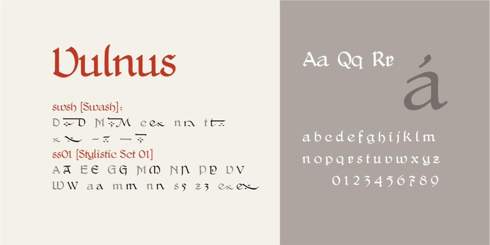

# Vulnus
- Versione 1.101: fix esportazione
- Versione 1.026: fix legature
- Versione 1.025: sistemazione di alcuni caratteri
- Versione 1.020: sistemazione di ß Ç ç
- Versione 1.015: sistemazione di alcuni caratteri
- Versione 1.0: versione iniziale

Per testare il font, vedere la [pagina interattiva](https://m-casanova.github.io/Vulnus/).

## Descrizione

Il carattere **Vulnus** è basato su scansioni di [*Delitsch-Antiqua*](https://fontsinuse.com/typefaces/73656/delitsch-antiqua), realizzato nel 1911.

Sono presenti alcune legature ed è possibile attivare caratteristiche opzionali:
- swsh (Swash): D M e n t ÷ – —
- ss01 (Stylistic Set 01): versioni alternative A E G M N P V W a m n s u z ß
